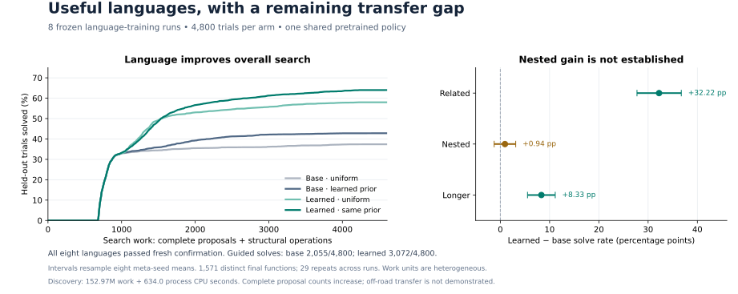

# Current scalar research checkpoint

The system now discovers useful nontrivial libraries in this restricted domain. It has **not** demonstrated a language advantage for nested compositions or transferred the successful language learner into off-road control.



## What changed since the negative result

Semantic inverse constraints and affine fragment proposals make the inner synthesizer substantially stronger. Population search starts from an empty library and proposes, races, and confirms whole languages. Aliases of existing primitives are rejected. The selected library and shared neural policy are frozen before final tasks. Learned functions are executable compositions of the scalar base language; this is not arbitrary type, memory, or perception discovery.

In the newest complete study, **8/8 independently seeded language-training runs accept a library and improve final search-work AUC**. All runs share one pretrained search policy, so this does not establish robustness to neural-training randomness. The final cohort contains 1,571 distinct empirical functions across 1,600 task instances, with three search repetitions per instance.

| Final arm | Solved / 4,800 | Solve rate |
|---|---:|---:|
| Base language, uniform guidance | 1,795 | 37.4% |
| Base language, learned prior | 2,055 | 42.8% |
| Learned language, uniform guidance | 2,783 | 58.0% |
| Learned language, same prior | 3,072 | 64.0% |

The guided language improvement is **21.19 percentage points**, with a meta-seed bootstrap interval of **18.23–24.06 pp**. Removing the learned library means rerunning the base arm with the same frozen policy, task, search seed and budget. Uniform-guidance arms also improve, so this is not merely a neural-prior intervention.

One actual automatically selected library contains:

```text
fn_2352281741(a) = max(a, -a)
fn_3197264005(a) = max(0, min(1, -a))
```

The [post-run concept audit](output/joint/lattice-evolution-v1/concept-audit.json) distinguishes direct magnitude/positive-part/clipping equivalents from equivalents requiring a sign or offset substitution. Those diagnostic concept names are not supplied to the learner.

## What remains unresolved

| Measurement | Current evidence |
|---|---|
| Overall held-out language utility | Positive in all eight new runs |
| Longer-expression solve gain | +8.33 pp, interval +5.52 to +11.15 |
| Nested-composition solve gain | +0.94 pp, interval −1.25 to +3.12; not established |
| Guided final process CPU | Base 53.26 s; learned 43.68 s |
| Complete program proposals | Increase with the learned language |
| Discovery cost for eight runs | 152.97M heterogeneous work units; 633.99 process CPU seconds |
| Observed payback for this new pipeline | Not measured; projections only |
| Off-road language transfer | Not demonstrated; the current terrain library is empty |

Work means complete proposals plus structural search operations. It is not an instruction count. Point arithmetic, model inference, CPU and elapsed wall time are separate measurements. Final evaluation costs and shared prior pretraining are additional to incremental language discovery.

A **separate original-solver experiment**, with one preselected frozen language and 20,000 sealed future functions, observed incremental discovery payback at task **8,944** and ended **7.44M work units cheaper** than repeating base search. This does not repay the shared 455M-work value-model source dataset or all research costs. Its wall-clock payback is unassessable because one raw timing row contains a long unexplained pause. [Observed-stream report and audit](output/joint/downstream-stream-v1/analysis.json).

## What is running next

Fresh solver refinement compares coefficient elimination, branch allocation, independently supported affine voting, and the visited-state production policy. Small adaptive calibrations and failed variants are retained. Six candidates are frozen before 500 new development functions; one winner must pass separate fresh confirmation. Selection rewards balanced synthesis efficiency across both languages and all structural groups, rather than maximizing an apparent language advantage.

The latest scalar results are in these files; the localhost presentation still shows historical experiments. The [eight-run protocol](LATTICE_PROTOCOL.md), [full analysis](output/joint/lattice-evolution-v1/analysis.json), [research log](JOINT_RESEARCH.md), and frozen JSON artifacts contain the detailed accounting and limitations.
